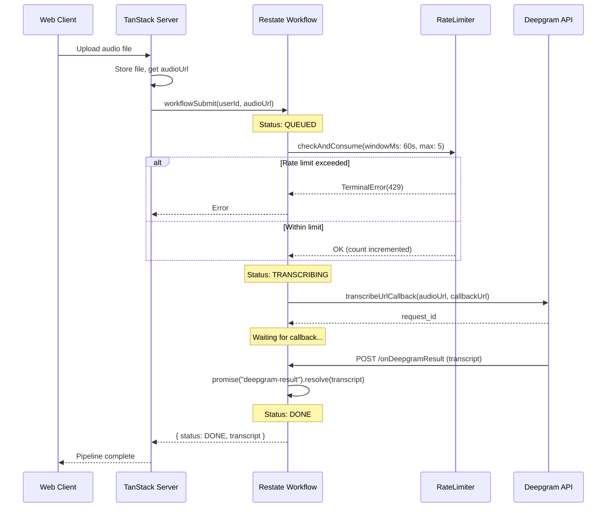

## TL;DR

## The Problem

## Architecture Overview

## Rate Limiting with Restate Virtual Objects

[Restate Rate Limiting Guide](https://docs.restate.dev/guides/rate-limiting)

## The Workflow Implementation

### Pipeline States

### Deepgram Callback Pattern

### Error Handling

## Why Restate?

## References

- [Restate SDK for Cloudflare Workers](https://docs.restate.dev/develop/ts/cloudflare-workers)
- [Restate Rate Limiting Guide](https://docs.restate.dev/guides/rate-limiting)
- [Deepgram Callback Transcription](https://developers.deepgram.com/docs/callback)
- [apps/restate source code](https://github.com/fastrepl/hyprnote/tree/main/apps/restate)
