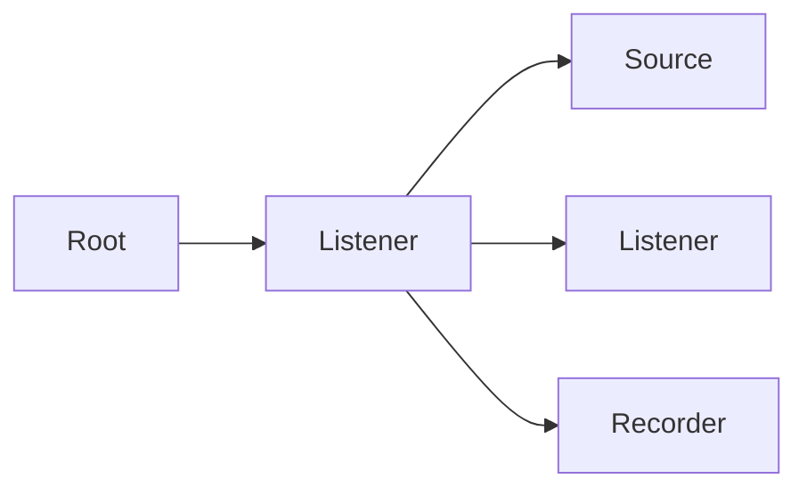

## TL;DR

- [Hyprnote](https://github.com/fastrepl/hyprnote) is open-source desktop app for meeting notes.
- It consists of multiple components, including audio pipeline and websocket server/client.
- We ended up using [Ractor](https://github.com/slawlor/ractor) for Erlang / OTP-style fault tolerance.
- Most of the code mentioned in this article is located in [plugins/listener/src](https://github.com/fastrepl/hyprnote/tree/main/plugins/listener/src).

## Background

- Desktop app is hard. Hardware/OS specific issues, limited observability since code runs on user's machine.
- We choose Tauri, which less mature than Electron, cause some delays/hussle especially in the early days.

- I have Elixir background. (https://news.ycombinator.com/item?id=41815694)
- Ractor is Actor framework in Rust. (https://docs.rs/ractor/latest/ractor/)
- See [Why Ractor](https://github.com/slawlor/ractor?tab=readme-ov-file#why-ractor)
- Ractor do not have supervisor implementation:
  - "Supervision is presently left to the implementor to outline handling of supervision events"
  - SO we use https://docs.rs/ractor-supervisor/latest/ractor_supervisor/.

https://chatgpt.com/c/69267f03-dd24-8322-a906-95f22feb5158

## Infra-level vs App-level fault tolerance

<Tweet id="1857429507445018947" />

Some might say why Erlang/Elixir is meaningful since we have K8S?
The answe is that they work in different layers.

In Hyprnote, this is desktop app. No k8s here.

## The Design

## Rest-For-One Strategy

[Erlang Docs](https://www.erlang.org/doc/system/sup_princ.html#rest_for_one)
